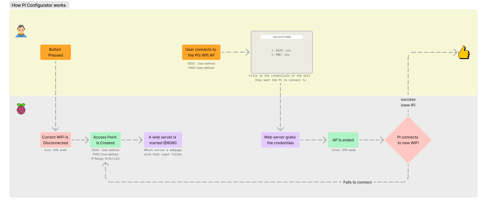

# README

## TODO:

- [x] Handle --- What if the desired WIFI doesn't have any PWD?
- [ ] Better: Add scan to get all wifi details before connecting ... ?
- [ ] Implement usage of config template ini vs hardcoded defaults 
- [x] Add the correct IP address display ...
- [x] Clean exit
- [x] Add "permission issues with PolicyKit for Debian Trixie" (for non-sudo usage) methods in install script ... 
- [x] LED show status if pi can;t find wifi after boot
- [x] uninstall script
- [ ] Check `http://link_to_install_script | sh` efforts

---

I never found a simple utility that headless-ly allows setting up wifi to a pi, without logging into it with a monitor and keyboard or pre-configuring it prior to setup with the wifi credentials. What if you can't use ethernet? Anf, what if you are using it in an installation or a setup where you can't be there and someone who is there doesn't know anything about SSH or is not into Linux? 

Well I have a solution.. (Behold)

Here with this utility, with the long press of a button, the rpi disconnects from any previously connected WiFi Access Points and creates a new Access Point. If the WiFi is not configured, then it doesn't matter. 

You can then connect to that Access Point (Check out how to customize that below), navigate to [http://10.10.1.1:4000](http://10.10.1.1:4000) and provide a SSID and PWD for a visible 2.5GHz network that you what your rpi to connect to. 

It will then disable the self initiated AP and connect to the provided SSID. If all goes well and the credentials were, correct, it will connect successfully.



---

## File Structure

```txt
├── app.py
├── assets/
├── button.py
├── config.template.ini
├── install.sh
├── led.py
├── LICENSE
├── logger.py
├── README.md
├── requirements.txt
├── rpi-btn-wifi-manager.service
├── setup_service.sh
├── uninstall.sh
└── wifi_config
    ├── network_manager.py
    ├── static
    │   ├── css
    │   │   └── style.css
    │   ├── images/*
    │   └── js
    │       ├── script.js
    │       └── socket.io.js
    ├── templates
    │   ├── general.html
    │   └── index.html
    └── web_server.py
```


## Hardware notes


1. Connect Button to  `GPIO 23 `
2. Connect LED to  `GPIO 24`

> [!Warning]
> If you want to use a different pin for the button to reconfigure Wifi (for whatever reason) make sure to after changing them (in ), makes the changes in the script. You can do so by editing [app.py](app.py). Find the line `WIFI_RESET_PIN = 23` and change it there. 


## Quick Installation - Automated Setup (Recommended)

```bash
git clone https://github.com/dattasaurabh82/rpi-wifi-configurator.git
cd rpi-wifi-configurator
./install.sh
```

The installer will:
- Check system requirements
- Prompt for GPIO pins and AP credentials
- Create virtual environment and install dependencies
- Configure NetworkManager hotspot
- Set up systemd service

## Manual Setup & Installation

### Customizing HW pins

- If you want to use a different pin for the button to reconfigure Wifi (for whatever reason) make sure to after changing them (in ), makes the changes in the script. You can do so by editing [app.py](app.py). Find the line `WIFI_RESET_PIN = 23` and change it there. 


### Customizing WIFI Settings

1. Create a new branch before making adjustments to your new pi project

```bash
# Create & switch to your branch
git branch [A_SUITABLE_NAME_PROJECT]
git checkout [A_SUITABLE_NAME_PROJECT]
```

2. In [app.py](app.py) change the SSID name

```bash
AP_SSID="[A_PREFERRED_SSID_NAME]"
```

3. Create a new hotspot/access_point scope using `nmcli`. So that the script [network_manager.py](wifi_config/network_manager.py) can control it and create an AP when needed for you to provide as SSID and WPA2/PSK for the pi to connect to.

```bash
sudo nmcli con add \
    type wifi \
    ifname wlan0 \
    con-name hotspot \
    autoconnect no \
    ssid [SAME_SSID_USED_ABOVE] \
    mode ap \
    ipv4.method shared \
    ipv4.addresses 10.10.1.1/24 \
    wifi-sec.key-mgmt wpa-psk \
    wifi-sec.psk "[YOUR_WPA2/PSK_PWD]"
```

> The value of `wifi-sec.psk` __must be same__ as the value of `AP_SSID` modified in [app.py](app.py)

4. Edit the html to customize according to your needs. Specifically edit these two files:
    
    1. [index.html](wifi_config/templates/index.html)

    ```html
    <title>[YOUR_PROJECT_NAME] Wi-Fi Configuration</title>
    ```

    ```html
    <h1>[YOUR_PROJECT_NAME] Wi-Fi Configuration</h1>
    ```

    2. [general.html](wifi_config/templates/general.html)

    ```html
    <title>[YOUR_PROJECT_NAME]</title>
    ```

    ```html
    <h1>[YOUR_PROJECT_NAME]</h1>
    ```

5. Update network discovery interface names (edit [app.py](app.py)) 

Find the line

```python
logger.info(f"[app.py][Status] Connect to wifi access point: {AP_SSID} and go to: http://[IP]:4000 to provide 2.5GHz Wifi credentials")
```

And, update `http://serialmonitor...` to either your ip or if network interface name is set, update to that. 


6. Create a virtual environment

```bash
python -m venv venv
source activate venv/bin/activate
```

> You must keep the new venv's name as `venv` 

7. Install dependencies

```bash
python -m pip install -r requirements.txt
```

8. Test Script

> Better run it when a monitor and keyboard is attached to the pi, as if you are SSHed into the rpi, then when it creates an AP, you will lose connection to your tunnel, until you connect to it's AP again as it disconnects from any associated station.

```bash
python app.py
```

Now you can _Long Press_ (> 4 sec) and you will see the prompts ...

Alright, now that it's working, let's organize ...

9. Commit & Push Changes

```bash
git add .
git commit -m "made my custom changes"
git push -u origin [YOUR_BRANCH_NAME_FROM_BEFORE]
# Wait to be merged
```

10. Automate to start this as a service in the background (also to start after reboots)

```bash
./setup_service.sh
systemctl --user start rpi-btn-wifi-manager.service
systemctl --user status rpi-btn-wifi-manager.service
```

> This sets it up as a user service by modifying the [rpi-btn-wifi-manager.service](rpi-btn-wifi-manager.service) and copying it over to `.config/systemd/user/` and enables it. 
You still have ot start it. 

---

## How to Use

### Default AP Credentials

If you haven't customized the AP settings, use these defaults:

- **SSID**: `RPI_NET_SETUP`
- **Password**: `12345678`

### Usage Steps

1. Very simple, if everything is wired up correctly and configured correctly, you can just long press the button for more than 4 sec and then the LED should `BLINK`.
2. Soon you should see the raspberry pi's AP mode's hotspot ([Step 3](https://github.com/dattasaurabh82/rpi-wifi-configurator/tree/main?tab=readme-ov-file#how-to-customize-wifi-settings)).
3. Join that with whatever PWD you set (or the default, if you have not customized the AP configs) in [Step 3](https://github.com/dattasaurabh82/rpi-wifi-configurator/tree/main?tab=readme-ov-file#how-to-customize-wifi-settings).
4. Then go to a browser and type in [http://10.10.1.1:4000](http://10.10.1.1:4000).
5. Enter the 2.5 GHz SSID name and PWD of the WiFi you want the pi to connect to.
6. If all goes well, you wil see the LED `BREATHING`; meaning it's attempting to connect to the wifi you just provided.
7. If it succeeds, the LED will go `SOLID` and then turn `OFF`, meaning it has successfully connected. 
8. If not, it will still blink, meaning, it's still in AP mode.
9. This means that the rpi is disconnecting from any previous WIFI and setting up an access point. 

---

## LED Status Indicators

The LED provides visual feedback about the WiFi configuration state:

| LED State | Pattern | Description |
|-----------|---------|-------------|
| **OFF** | No light | Connected to WiFi (normal operation) |
| **SLOW_BREATH** | Smooth breathing effect | WiFi disconnected, searching, or attempting connection |
| **FAST_BLINK** | Quick blink (0.5s on/off) | AP mode active (ready for configuration) |
| **SOLID** | Constant on (2 seconds) | WiFi connection successful (then turns OFF) |

### State Transitions

```
Boot → SLOW_BREATH (searching for WiFi)
     ↓
     WiFi Found → SOLID (2s) → OFF (connected)
     ↓
     WiFi Lost → SLOW_BREATH (disconnected)
     
Long Press → FAST_BLINK (AP mode active)
     ↓
     User Configures → SLOW_BREATH (attempting connection)
     ↓
     Success → SOLID (2s) → OFF (connected)
     ↓
     Failure → FAST_BLINK (back to AP mode)
```

---

## Attribution

```text
Saurabh Datta
zigzag.is [Principal Designer]
Berlin
January 2025 (2nd iteration, Dec 2025)
hi@dattasaurabh.com
```

